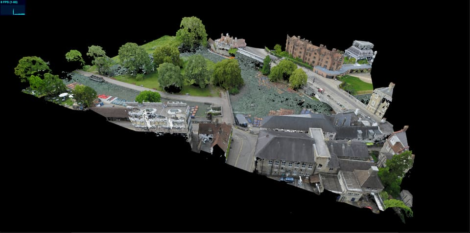

# WebGL Code Exercise

## Task

DISCLAIMER: This task was written with WebGL in mind (the graphics api used at sensat).
It can be completed using any graphics framework/api that you are comfortable working with.

Given some GLTF pointclouds, display the data in webgl and allow the user to select a point on the point cloud.
The data can be found [here](https://drive.google.com/drive/folders/1zrnqPXw9se_IdKcyerjaCF4sMmbS8nQ_?usp=sharing)

- `big_cloud.glb` test data to display
- `small_cloud.glb` small amount of data, useful for development.

### Goals

1. Display point data on screen
2. Implement point selection (console logging the points location is sufficient)
3. Produce a document explaining design choices, approach & build/run instructions.

### Bonus Goals (If you feel like it)

- Optomise app performance.
- Change colour of selected point.
- Build tool to measure distance between 2 points.
- Unit tests

### Tips & Tricks

- Feel free to use the existing code in this repo as a starting point, writing your own app from scratch is also accepted.
- You can change the code in the existing project as you see fit.
- You can use whatever libraries you see fit.
- You can alter the data, as long as the end visualisation looks the same.
- Document everything! This is the easiest way for you to supply us with context for the submission. - What decisions/compromises where made? - What you would improve/change? - What you learned? - Anything else!

## Using the existing code

Starter code for exercise, using typescript & Threejs

### Install

To install dependencies run:

    $ yarn

### Development

    $ yarn start

Serves the development build on `http://localhost:8080/index.html`, which will rebuild on file changes.

### Serving Assets

The starter code is configured to serve any static assets (e.g. 3D models) from an `assets/` directory.
They can be referenced by your app like so `assets/big_cloud.glb`.
